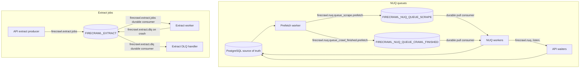
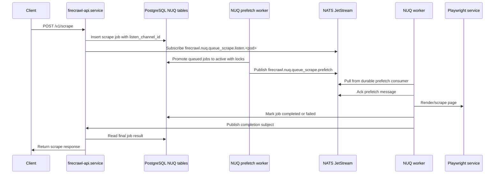

# Native Firecrawl NATS Architecture

## Runtime Topology

```mermaid
flowchart LR
  client[API client] --> api[firecrawl-api.service]
  api --> pg[(PostgreSQL firecrawl)]
  api --> df[(DragonflyDB Redis protocol)]
  api --> nats[(NATS JetStream)]
  api --> playwright[firecrawl-playwright.service]

  prefetch[firecrawl-nuq-prefetch-worker.service] --> pg
  prefetch --> nats

  nuq[firecrawl-nuq-worker@.service] --> nats
  nuq --> pg
  nuq --> df
  nuq --> playwright

  worker[firecrawl-worker.service] --> nats
  worker --> pg
  worker --> df

  extract[firecrawl-extract-worker.service] --> nats
  extract --> pg
  extract --> df

  reconciler[firecrawl-nuq-reconciler-worker.service] --> pg

  rabbit[RabbitMQ / AMQP 5672 removed from Firecrawl runtime]
```

## Queue Subjects And Streams



## Scrape Job Sequence



## Service Dependency Graph

```mermaid
flowchart LR
  target[firecrawl.target]
  nats[nats.service]
  dragonfly[dragonfly.service]
  postgres[postgresql@16-main.service]
  playwright[firecrawl-playwright.service]
  api[firecrawl-api.service]
  worker[firecrawl-worker.service]
  extract[firecrawl-extract-worker.service]
  nuqWorker[firecrawl-nuq-worker@.service]
  prefetch[firecrawl-nuq-prefetch-worker.service]
  reconciler[firecrawl-nuq-reconciler-worker.service]

  target --> api
  target --> worker
  target --> extract
  target --> nuqWorker
  target --> prefetch
  target --> reconciler
  target --> playwright

  api --> nats
  api --> dragonfly
  api --> postgres
  api --> playwright

  worker --> nats
  worker --> dragonfly
  worker --> postgres

  extract --> nats
  extract --> dragonfly
  extract --> postgres

  nuqWorker --> nats
  nuqWorker --> dragonfly
  nuqWorker --> postgres

  prefetch --> nats
  prefetch --> dragonfly
  prefetch --> postgres

  reconciler --> nats
  reconciler --> dragonfly
  reconciler --> postgres
```
